# Synthetic route generation

The code in this repository is an extension of an existing project developed by the KDD Lab at ISTI-CNR (Pisa). The goal of the project is to generate and clone Individual Mobility Networks from a source area, where trajectory data is available, to a destination area, where such data is potentially missing. This extension focuses on route generation to connect the IMN locations mapped onto the destination area, implementing a more sophisticated approach to learn user preferences and compute user-customized routes (instead of relying on a simple, unrealistic shortest path computation).

Part of the code uses the Valhalla routing engine for map-matching, which requires a running instance to generate tile extracts from OpenStreetMap; refer to the [Valhalla documentation](https://valhalla.readthedocs.io/en/latest/) for more information on how to set up and run Valhalla.

## Requirements
```
Python==3.10.9
Flask==3.1.0
folium==0.18.0
geohash2==1.1
geopandas==1.0.1
geopy==2.4.1
networkx==3.4.2
numpy==2.1.3
osmnx==2.0.0
pandas==2.2.3
pytz==2024.2
rasterio==1.4.2
Requests==2.32.3
scikit_learn==1.5.2
scipy==1.14.1
Shapely==2.0.6
tqdm==4.67.1
pyvalhalla==3.2.0
```

## Running the code
Below is a brief description of the main functions and how to run them. Refer to the `example.ipynb` notebook for interactive execution of the code.

```python
import os

import numpy as np
import pandas as pd
import osmnx as ox
import matplotlib.pyplot as plt

import imn_generation
import imn_loading
from map_matching import (map_match_valhalla_all,
                          points_to_osmnx_routes,
                          read_osmnx_routes)
from experiments.trajectory_analysis import (dtw_overlap_all,
                                             get_route_edge_attributes,
                                             get_adjusted_edge_attributes)
from personalized_routing import (add_edge_attributes,
                                  compare_fastest,
                                  learn_user_preferences)
```

### Loading the data
Trajectory data is assumed to be GPS traces, in tabular format, with columns `userid`, `timestamp`, `latitude`, and `longitude`. This data is read, and the graph that covers the area of interest is downloaded from OpenStreetMap.


```python
# Using a sample dataset of Milan, Italy
points_df = pd.read_csv('data/sample_Milan_2007.csv.gz').rename(columns={
    'userid':'id', 
    'datetime':'timestamp',
    'lon':'longitude', 
    'lat':'latitude'
})

# Convert timestamp string to Epoch in seconds
points_df['timestamp'] = pd.to_datetime(points_df['timestamp']).values.astype(np.int64) // 10 ** 9
```

```python
# Download and save the OSM graph for the area of interest
# Buffer around to avoid cutting off edges at the border
bufsize = 0.01
bbox = (np.min(points_df['longitude'] - bufsize),
         np.min(points_df['latitude'] - bufsize),
         np.max(points_df['longitude'] + bufsize),
         np.max(points_df['latitude'] + bufsize))

G = ox.graph_from_bbox(bbox, network_type='drive', simplify=False)

# Keep only the largest strongly connected component
G = ox.truncate.largest_component(G, strongly=True)

# Add:
# - residential/motorway (binary variables)
# - area of landuse (industrial, commercial, residential, green areas, water areas)
# - POI type counts, categorized by stop length/flow intensity (short, medium, high/low, medium, high)
G = add_edge_attributes(G)
ox.save_graphml(G, 'data/milano_2007_graph.graphml')
```

```python
ox.plot_graph(G, node_size=0, edge_linewidth=0.5, edge_color='gray', bgcolor='white', show=True)
```  
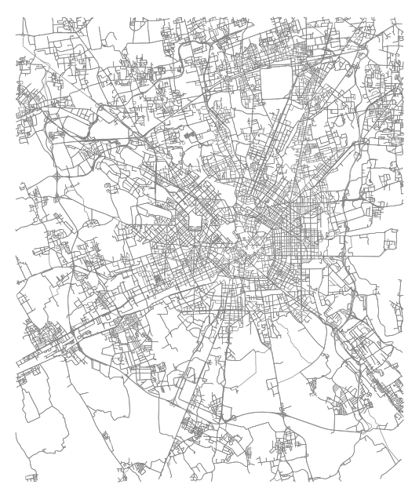


### Constructing the IMN + map-matching

```python
# IMN generation takes care of segmentation (tau_s = 50 m, tau_t = 1200 s)
# Also removes large errors in trajectories with a max speed threshold of 252 km/s
# Also discards users with too little history (< 10 trajs)
imn_generation.main_from_code(points_df, 'data/milano_2007_imns.json.gz')
imns = imn_loading.read_imn('data/milano_2007_imns.json.gz')
segmented_trajs = imn_loading.get_trajectories_from_imns(imns)
```

```python
# 1st step: map-match
# Must have constructed the tile extracts for Valhalla in advance, see README
map_match_valhalla_all(segmented_trajs,
                       output_path='data/milano_2007_mapmatched.csv.gz',
                       tile_extract='valhalla/valhalla_tiles.tar',
                       verbose=True)

# 2nd step: convert map-matched points to OSMnx routes
G = ox.load_graphml('data/milano_2007_graph.graphml')
points_to_osmnx_routes(G,
                       input_path='data/milano_2007_mapmatched.csv.gz',
                       output_path='data/milano_2007_routes.csv.gz',
                       verbose=True)

routes = read_osmnx_routes('data/milano_2007_routes.csv.gz')
```

```python
# Example of a route: it stores start + end timestamps and traversed nodes
print(routes[650][0]['start_timestamp'])
print(routes[650][0]['end_timestamp'])
print(routes[650][0]['nodes'][0:9])
```
    1175753856
    1175754597
    [12877870309, 12877870308, 12877870309, 3028366658, 1841346140, 2550433826, 2550433823, 253752169, 1555859669]


### Example route visualization
Plotting the same route: before map-matching and after map-matching

```python
from experiments.trajectory_analysis import get_route_bbox
```

```python
orig_route = segmented_trajs[650].query('id == 8')
osmnx_route = routes[650][8]['nodes']

bbox = get_route_bbox(G, [osmnx_route])

# Original points
fig, ax = plt.subplots(1,2, figsize=(8,6))
ox.plot_graph(G, ax=ax[0],
              edge_color='gray',
              bgcolor='white',
              edge_linewidth=0.5, node_size=0,
              bbox=bbox,
              close=False,
              show=False)
ax[0].scatter(orig_route['longitude'], orig_route['latitude'], c='red', s=10)

# Route
ox.plot_graph(
    G, ax=ax[1],
    edge_color='gray', bgcolor='white',
    edge_linewidth=0.5, node_size=0,
    bbox=bbox, close=False, show=False
)
ox.plot_graph_route(G, osmnx_route, ax=ax[1],
                    route_color='blue',
                    edge_color='gray',
                    bgcolor='white',
                    edge_linewidth=0.5,
                    route_linewidth=2, node_size=0,
                    bbox=bbox,
                    close=False,
                    show=False)

plt.show()
``` 
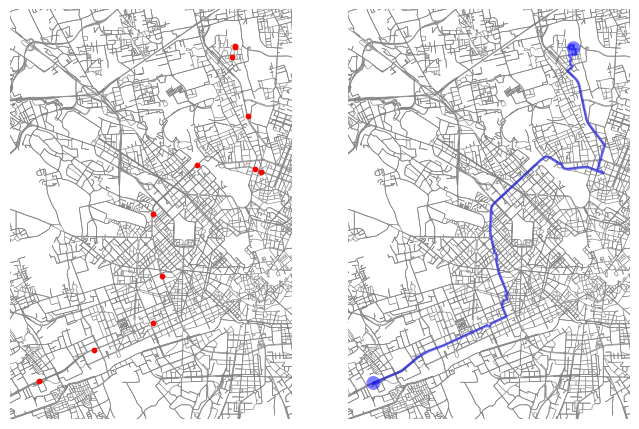

### Data exploration
Comparing real routes with different single-cost optimizing routes

```python
G = ox.load_graphml('data/milano_2007_graph.graphml')
routes = read_osmnx_routes('data/milano_2007_routes.csv.gz')
```

---

#### DTW / Jaccard
```python
dtw_overlap_all(G,
                routes,
                filename='data/milano_2007_dtw_overlap.csv.gz',
                num_processes=1,
                verbose=True)

dtw_overlap = pd.read_csv('data/milano_2007_dtw_overlap.csv.gz')
```

```python
# Distribution of DTW and Jaccard
fig, ax = plt.subplots(1, 2, figsize=(12, 4))

ax[0].hist(dtw_overlap['dtw_travel_time'], bins='sqrt', edgecolor='black', color='tab:blue')
ax[0].set_xlabel('DTW (m)')
ax[0].set_ylabel('Frequency')

ax[1].hist(dtw_overlap['overlap_travel_time'], bins='sqrt', edgecolor='black', color='tab:orange')
ax[1].invert_xaxis()
ax[1].set_xlabel('Overlap (%)')
ax[1].set_ylabel('Frequency')

fig.suptitle('Distribution of DTW and Overlap w.r.t. Fastest Paths')
plt.tight_layout()
plt.show()

fig, ax = plt.subplots(1, 2, figsize=(12, 4))

ax[0].hist(dtw_overlap['dtw_length'], bins='sqrt', edgecolor='black', color='tab:blue')
ax[0].set_xlabel('DTW (m)')
ax[0].set_ylabel('Frequency')

ax[1].hist(dtw_overlap['overlap_length'], bins='sqrt', edgecolor='black', color='tab:orange')
ax[1].invert_xaxis()
ax[1].set_xlabel('Overlap (%)')
ax[1].set_ylabel('Frequency')

fig.suptitle('Distribution of DTW and Overlap w.r.t. Shortest Paths')
plt.tight_layout()
plt.show()
``` 
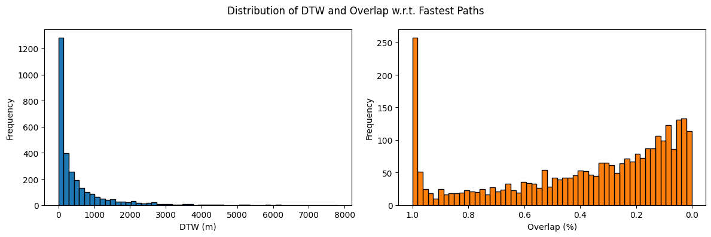  
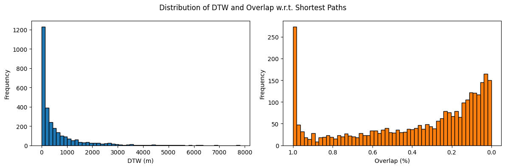

---

#### Edge-by-edge attributes
Full collection of attributes from each edge traversed by all routes in the data, no aggregation

```python
get_route_edge_attributes(G,
                          routes,
                          center={'y': 45.46823695109099, 'x': 9.182262786187506},
                          filename_real='data/milano_2007_attr_real.csv.gz',
                          filename_fastest='data/milano_2007_attr_fastest.csv.gz',
                          verbose=True)

real_df = pd.read_csv('data/milano_2007_attr_real.csv.gz')
fastest_df = pd.read_csv('data/milano_2007_attr_fastest.csv.gz')
```

```python
# Example: plotting histograms of all edge attributes, comparing real vs fastest routes
attributes = [
    'length',
    'speed_kph',
    'travel_time',
    'residential',
    'motorway',
    'stop_short',
    'stop_medium',
    'stop_long',
    'flow_low',
    'flow_medium',
    'flow_high',
    'water',
    'landuse_green',
    'landuse_commercial',
    'landuse_residential',
    'landuse_industrial',
]

real_df_grouped = real_df.groupby('uid')[attributes].mean()
fastest_df_grouped = fastest_df.groupby('uid')[attributes].mean()

fig, ax = plt.subplots(4, 4, figsize=(20,20))
for i, attr in enumerate(attributes):
    real_data = real_df_grouped[attr]
    fastest_data = fastest_df_grouped[attr]

    bins = np.histogram(np.hstack((real_data, fastest_data)), bins=int(3*np.log2(len(real_data))+1))[1]
    
    ax[i//4, i%4].hist(real_data, bins=bins, edgecolor='black', alpha=0.5, label='real')
    ax[i//4, i%4].hist(fastest_data, bins=bins, edgecolor='black', alpha=0.5, label='fastest')
    ax[i//4, i%4].set_title(attr)
    ax[i//4, i%4].legend()

plt.tight_layout()
plt.show()
```
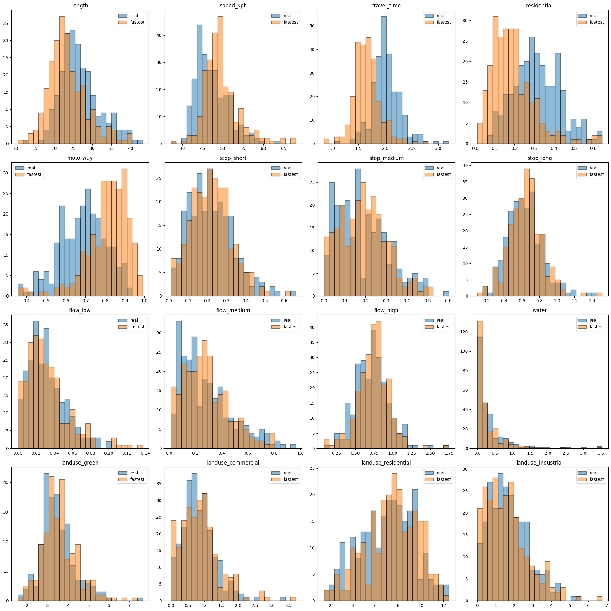

### Compute real/fastest edge attributes (+ alphas)
To determine where/how fastest routes differ from real routes, we compute, for each user $u$ and each attribute $i$, the relative gap:
$$
    \delta_u^i = \frac{\mu(E_u^{real}, i) - \mu(E_u^{fst}, i)}{\mu(E_u^{fst}, i)} \in [-1, \infty),\\
    \mu(E, i) = \frac{\sum_{e \in E} \phi_i(e)}{|E|}
$$
where $\phi_i(e)$ is the value of attribute $i$ for edge $e$, $E_u^{real}$ the set of edges traversed by the real routes of user $u$, and $E_u^{fst}$ be the set of edges traversed by fastest routes of user $u$.

```python
# Aggregated edge attributes + alphas
# Real data also includes the attributes necessary for clustering
compare_fastest(G,
                routes,
                real_path='data/milano_2007_aggregated_real.csv.gz',
                fastest_path='data/milano_2007_aggregated_fastest.csv.gz',
                alphas_path='data/milano_2007_alphas.json',
                num_processes=1,
                verbose=True)
```

```python
df_real = pd.read_csv('data/milano_2007_aggregated_real.csv.gz')
df_fastest = pd.read_csv('data/milano_2007_aggregated_fastest.csv.gz')

gaps = []
for uid in df_real['uid'].unique():
    means_real = df_real[df_real['uid'] == uid][attributes].values[0]
    means_fastest = df_fastest[df_fastest['uid'] == uid][attributes].values[0]

    gap = np.where(means_fastest != 0,
                   (means_real - means_fastest) / means_fastest,
                   np.where(means_real != 0, np.inf, 0))
    gaps.append(gap)
gaps = np.array(gaps)
```

```python
# Plotting the distribution of the relative gaps
plt.figure(figsize=(10, 5))
for i, attr in enumerate(attributes):
    plt.boxplot(gaps[~np.isnan(gaps[:, i]), i], positions=[i], widths=0.3, showfliers=False,
                patch_artist=True,
                boxprops=dict(facecolor='tab:blue', alpha=0.5),
                medianprops=dict(color='tab:blue'))
plt.xticks(range(len(attributes)), attributes, rotation=45, ha='right')
plt.grid(axis='y', linestyle='--', alpha=0.7)
plt.ylabel('Relative Gap (Real vs Fastest)')
plt.show()
``` 
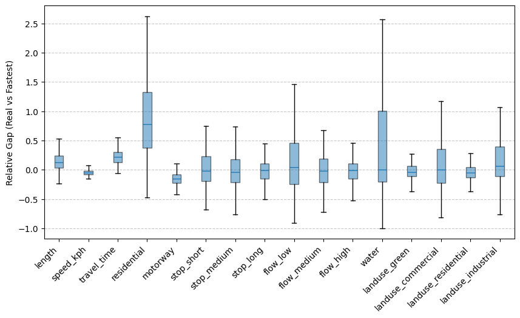

# Running the search algorithm

```python
G = ox.load_graphml('data/milano_2007_graph.graphml')
routes = read_osmnx_routes('data/milano_2007_routes.csv.gz')
```

### Testing beta = 1.0

```python
cost_attributes = ['residential', 'landuse_industrial', 'landuse_commercial', 'flow_low', 'water']
```

```python
# Can be used for any constant beta: we tested beta=1 to see how cost function behaves
get_adjusted_edge_attributes(G, routes, 1.0, cost_attributes,
                             filename_adjusted='data/milano_2007_allones.csv.gz',
                             filename_alphas='data/milano_2007_alphas.json', verbose=True)
```

```python
df_real = pd.read_csv('data/milano_2007_aggregated_real.csv.gz')
df_fastest = pd.read_csv('data/milano_2007_aggregated_fastest.csv.gz')
df_allones = pd.read_csv('data/milano_2007_allones.csv.gz')

gaps_fst = []
gaps_allones = []
for uid in df_real['uid'].unique():
    means_real = df_real[df_real['uid'] == uid][attributes].values[0]
    means_fastest = df_fastest[df_fastest['uid'] == uid][attributes].values[0]
    means_allones = df_allones[df_allones['uid'] == uid][attributes].values[0]

    gap_fst = np.where(means_fastest != 0,
                       (means_real - means_fastest) / means_fastest,
                       np.where(means_real != 0, np.inf, 0))
    gaps_fst.append(gap_fst)

    gap_allones = np.where(means_allones != 0,
                           (means_real - means_allones) / means_allones,
                           np.where(means_real != 0, np.inf, 0))
    gaps_allones.append(gap_allones)

gaps_fst = np.array(gaps_fst)
gaps_allones = np.array(gaps_allones)
```

```python
# Comparing relative gaps, now putting fastest vs adjusted side-by-side
plt.figure(figsize=(16, 5))
for i, attr in enumerate(attributes):
    plt.boxplot(gaps_fst[~np.isnan(gaps_fst[:, i]), i], positions=[i - 0.15], widths=0.2,
                showfliers=False,
                patch_artist=True,
                boxprops=dict(facecolor='tab:blue', alpha=0.5),
                medianprops=dict(color='tab:blue'))
    plt.boxplot(gaps_allones[~np.isnan(gaps_allones[:, i]), i], positions=[i + 0.15], widths=0.2, showfliers=False,
                patch_artist=True,
                boxprops=dict(facecolor='tab:orange', alpha=0.5),
                medianprops=dict(color='tab:orange'))
    
plt.xticks(range(len(attributes)), attributes, rotation=45, ha='right')
plt.grid(axis='y', linestyle='--', alpha=0.7)
plt.legend(['Fastest', 'Adjusted'])
plt.ylabel('Relative Gap (Real vs Fastest)')
plt.show()
``` 
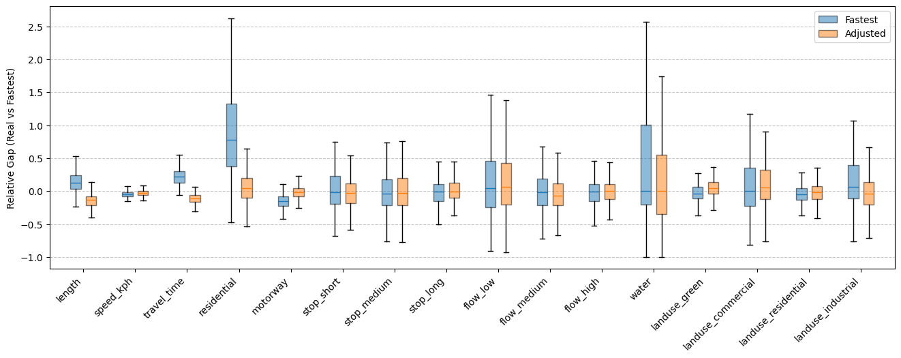

### Identifying clusters
Clustering is done to identify user profiles, i.e., groups of users with similar preferences. The clustering is performed on mean, median, 1st and 3rd quartile of each attribute grouped by user. Clustering algorithm used is hierarchical clustering + ward linkage + euclidean distance

```python
from scipy.cluster.hierarchy import dendrogram, fcluster
from sklearn.preprocessing import StandardScaler
from sklearn.cluster import AgglomerativeClustering
```

```python
def get_linkage_matrix(model):
    counts = np.zeros(model.children_.shape[0])
    
    n_samples = len(model.labels_)
    for i, merge in enumerate(model.children_):
        current_count = 0
        for child_idx in merge:
            if child_idx < n_samples:
                current_count += 1  # leaf node
            else:
                current_count += counts[child_idx - n_samples]
        counts[i] = current_count

    linkage_matrix = np.column_stack(
        [model.children_, model.distances_, counts]
    ).astype(float)

    return linkage_matrix

def plot_dendrogram(model, **kwargs):
    linkage_matrix = get_linkage_matrix(model)
    dendrogram(linkage_matrix, **kwargs)
```

```python
# Data contains: mean, median, 1st quartile, 3rd quartile
df_real = pd.read_csv('data/milano_2007_aggregated_real.csv.gz')

# Exclude uid column
X = df_real.drop(columns=['uid']).values
X = StandardScaler().fit_transform(X)
```

```python
model = AgglomerativeClustering(distance_threshold=0, n_clusters=None, metric='euclidean', linkage='ward')
model.fit(X)
```

```python
# Chose to split data into three clusters based on dendrogram

plt.figure(figsize=(7.5,5))
plot_dendrogram(
    model,
    truncate_mode="lastp",
    color_threshold=40,
    above_threshold_color="grey"
)
plt.xlabel("Number of points in node")
plt.ylabel("Distance of split")
plt.show()

t = 40
Z = get_linkage_matrix(model)

labels = fcluster(Z, t=t, criterion='distance')

labels_u, counts = np.unique(labels, return_counts=True)
for l, c in zip(labels_u, counts):
    print('Cluster ', l, ': ', c)

df_real['label'] = labels
```
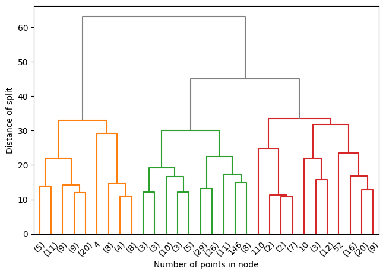

    Cluster  1 :  75
    Cluster  2 :  99
    Cluster  3 :  74

```python
# Mapping each cluster to the uids of the users belonging to that cluster,
# necessary for the iterative algorithm to learn the betas
cluster_to_uid = {cluster: df_real[df_real['label'] == cluster]['uid'].tolist()
                  for cluster in df_real['label'].unique()}
```

```python
# All intermediate MAEs + betas are saved to the results_dir
# If cluster_to_uid is not None, each cluster has its own subdirectory
cluster_to_beta = learn_user_preferences(G,
                                         routes,
                                         cost_attributes = ['residential', 'landuse_industrial', 'landuse_commercial', 'flow_low', 'water'],
                                         alphas_path='data/milano_2007_alphas.json',
                                         real_path='data/milano_2007_aggregated_real.csv.gz',
                                         results_dir='data/milano_results/',
                                         iterations=5,
                                         num_processes=2,
                                         cluster_to_uid=cluster_to_uid,
                                         verbose=True)
```

```python
# Betas found for each cluster
cluster_to_beta
```
    {np.int32(2): {'residential': np.float64(5.0),
      'landuse_industrial': np.float64(2.5),
      'landuse_commercial': np.float64(0.5),
      'flow_low': np.float64(25.0),
      'water': np.float64(2.5)},
     np.int32(1): {'residential': np.float64(6.25),
      'landuse_industrial': np.float64(5.0),
      'landuse_commercial': np.float64(2.5),
      'flow_low': np.float64(25.0),
      'water': np.float64(2.5)},
     np.int32(3): {'residential': np.float64(5.0),
      'landuse_industrial': np.float64(5.0),
      'landuse_commercial': np.float64(5.0),
      'flow_low': np.float64(50.0),
      'water': np.float64(50.0)}}

### Visualizing results for each cluster


```python
def show_config_results(cluster, cluster_to_uid):
    attributes = [
        'length',
        'speed_kph',
        'travel_time',
        'residential',
        'motorway',
        'stop_short',
        'stop_medium',
        'stop_long',
        'flow_low',
        'flow_medium',
        'flow_high',
        'water',
        'landuse_green',
        'landuse_commercial',
        'landuse_residential',
        'landuse_industrial',
    ]

    cost_attributes = [
        'residential',
        'landuse_industrial',
        'landuse_commercial',
        'flow_low',
        'water',
    ]
    
    data_path = f'data/milano_results/cluster_{cluster}'

    # Pick last iteration results
    gaps_path = None
    for i in range(25,0,-1):
        if os.path.exists(f'{data_path}/gaps_iter_{i}.csv'):
            gaps_path = f'{data_path}/gaps_iter_{i}.csv'
            break
    gaps_adj = pd.read_csv(gaps_path).values.T

    # Read real and fastest data for the cluster to compare
    df_real = pd.read_csv('data/milano_2007_aggregated_real.csv.gz')
    df_fastest = pd.read_csv('data/milano_2007_aggregated_fastest.csv.gz')

    cluster_uids = cluster_to_uid.get(cluster, [])

    df_real = df_real[df_real['uid'].isin(cluster_uids)]
    df_fastest = df_fastest[df_fastest['uid'].isin(cluster_uids)]

    gaps_fst = []
    for uid in cluster_uids:
        xbar_real = df_real[df_real['uid'] == uid][attributes].values[0]
        xbar_opt = df_fastest[df_fastest['uid'] == uid][attributes].values[0]

        gap = np.where(
            xbar_opt != 0.0,
            (xbar_real - xbar_opt) / xbar_opt,
            np.where(
                xbar_real != 0.0,
                np.nan,
                0.0
            )
        )
        gaps_fst.append(gap)
    # Transpose to have attributes as columns, consistent with gaps_adj
    gaps_fst = np.array(gaps_fst).T

    # Print final global MAE
    print("MAE Adjusted:", np.nanmean(np.abs(gaps_adj)))
    print("MAE Fastest:", np.nanmean(np.abs(gaps_fst)))

    ### PLOTTING GAPS VS FASTEST ###
    plt.figure(figsize=(18, 6))
    for i in range(len(attributes)):
        boxplot = plt.boxplot(gaps_fst[i][~np.isnan(gaps_fst[i])], positions=[i-0.15], widths=0.20, patch_artist=True, showfliers=False)
        boxplot['boxes'][0].set_facecolor('tab:blue')
        boxplot['boxes'][0].set_alpha(0.5)
        boxplot['medians'][0].set_color('tab:blue')

        boxplot_adj = plt.boxplot(gaps_adj[i][~np.isnan(gaps_adj[i])], positions=[i+0.15], widths=0.20, patch_artist=True, showfliers=False)
        boxplot_adj['boxes'][0].set_facecolor('tab:orange')
        boxplot_adj['boxes'][0].set_alpha(0.5)
        boxplot_adj['medians'][0].set_color('tab:orange')
    plt.xticks(range(len(attributes)), attributes, rotation=45, ha='right')
    plt.ylabel('Relative gap')
    plt.grid(axis='y', alpha=0.5)
    plt.legend(['Fastest', 'Adjusted'])

    plt.tight_layout()
    plt.show()


    # Plotting MAE by (sub)iteration
    global_maes = []
    for i in range(25):
        filename = f'{data_path}/gaps_iter_{i}.csv'

        if not os.path.exists(filename):
            # Iteration had no improvements
            global_maes.append(np.nan)
        else:
            gaps = pd.read_csv(filename).values
            mae_adj = np.nanmean(np.abs(gaps))
            global_maes.append(mae_adj)
    global_maes = np.array(global_maes)

    plt.figure(figsize=(10, 6))
    plt.plot(np.nonzero(~np.isnan(global_maes))[0],
             global_maes[~np.isnan(global_maes)],
             color='gray')

    # Adding scatter points of alternate colors to distinguish costs
    for i in range(5):
        plt.scatter(np.arange(len(global_maes))[i::5],
                    global_maes[i::5], color=plt.cm.plasma(i/4),
                    zorder=5, label=cost_attributes[i])
    plt.legend()
    plt.xticks(np.arange(max(np.nonzero(~np.isnan(global_maes))[0]) + 1),
               np.arange(1, max(np.nonzero(~np.isnan(global_maes))[0]) + 2))
    plt.title('Global MAE over iterations')
    plt.xlabel('Iteration')
    plt.ylabel('MAE')

    plt.grid(axis='y', alpha=0.5)
    plt.tight_layout()
    plt.show()
```

```python
print("CLUSTER 1 RESULTS:")
show_config_results(1, cluster_to_uid)

print("CLUSTER 2 RESULTS:")
show_config_results(2, cluster_to_uid)

print("CLUSTER 3 RESULTS:")
show_config_results(3, cluster_to_uid)
```
    CLUSTER 1 RESULTS:
    MAE Adjusted: 0.25645871973506057
    MAE Fastest: 0.38692190758568806
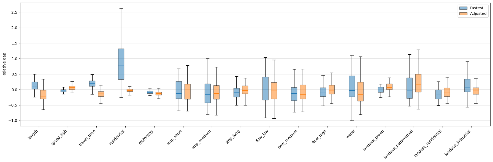
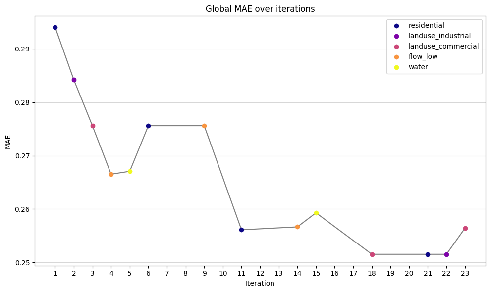

    CLUSTER 2 RESULTS:
    MAE Adjusted: 0.22426408826741306
    MAE Fastest: 0.3439408181122864
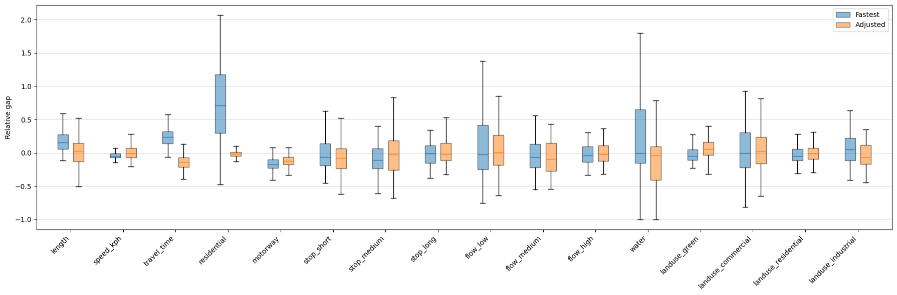    
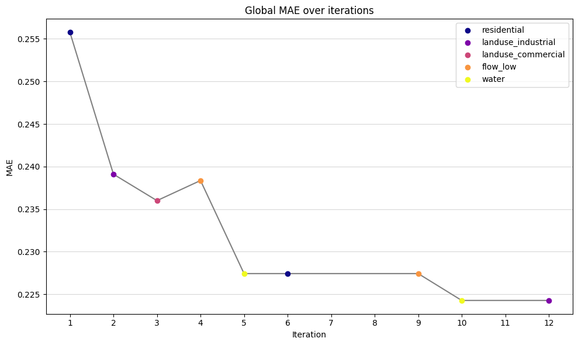

    CLUSTER 3 RESULTS:
    MAE Adjusted: 0.20758127478483648
    MAE Fastest: 0.32312783410509555 
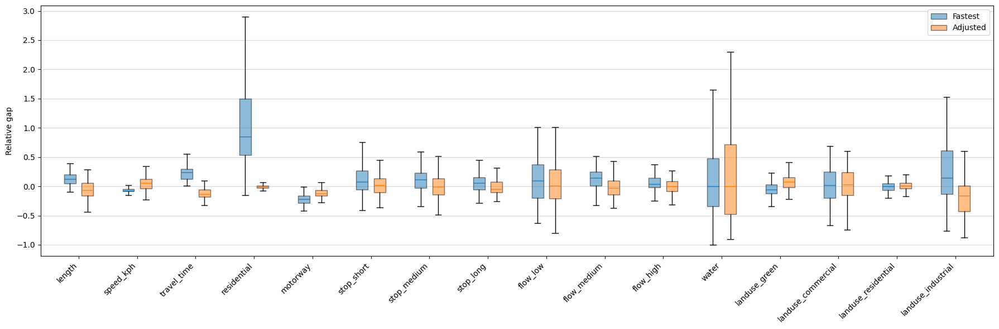    
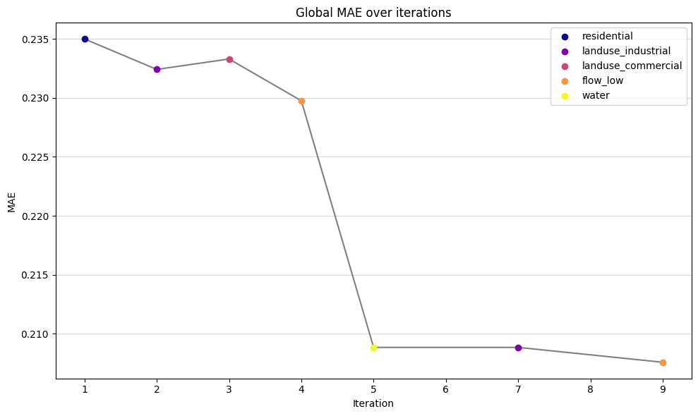